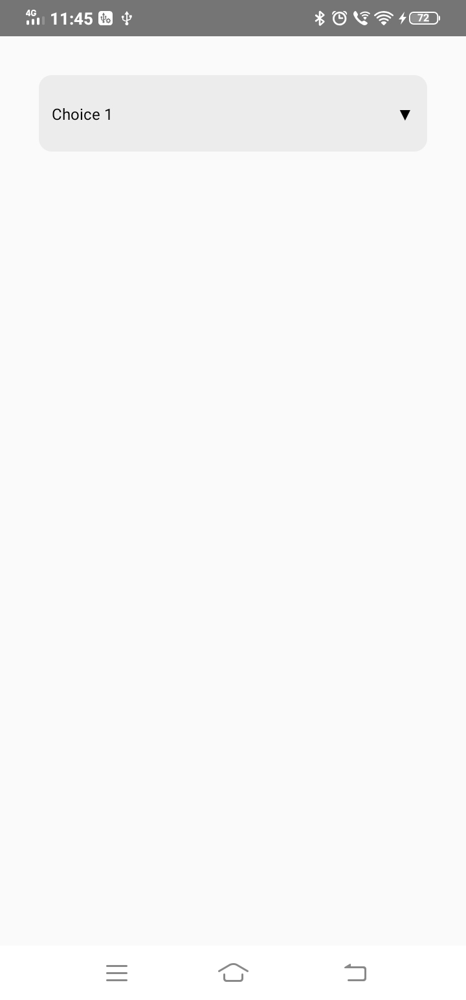
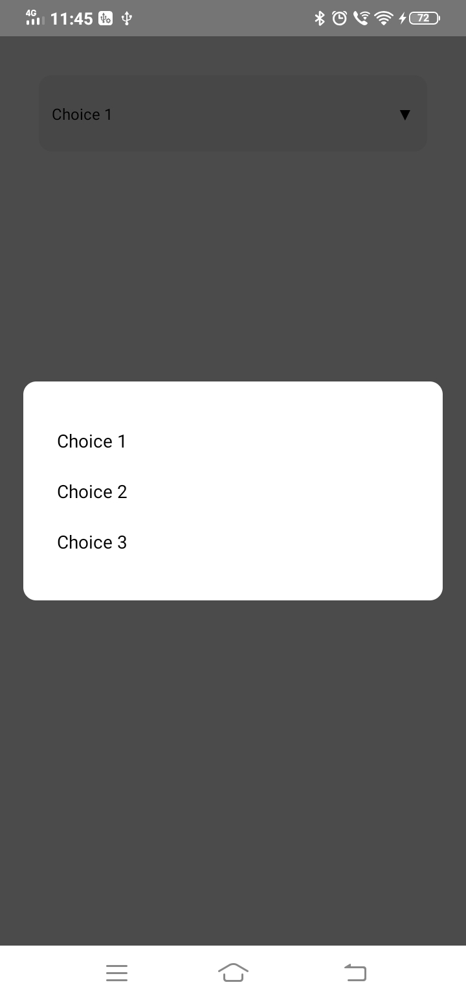

# react-native-rich-picker

<div>
  <a href="https://github.com/facebook/react-native/blob/HEAD/LICENSE">
    
  </a>
  <a href="https://twitter.com/intent/follow?screen_name=saai_tejaa">
    
  </a>
  <a href="https://badge.fury.io/js/react-native-rich-picker">
    
  </a>
  <a href="https://github.com/prettier/prettier">
    
  </a>
</div>

A highly customisable picker for react native.


<div style="display: flex; justify-content: center">


</div>

## Features

1. A customisable picker bar with text and right icon.
2. A modal which pops up with the picker choices you give.

## Setup

You can install this library via npm by: `npm i react-native-rich-picker`

## Usage

Following are the steps to start using this picker.

1. Import
```js
import Picker from 'react-native-rich-picker'
```

2. Creating the component

**Note:** As this is a highly customisable component, we haven't added any default styles and all the styles has to be created by default. 

Thus i am providing a full component below which you can use as a starting point.
```js

import React, {useState, useEffect} from 'react';
import {SafeAreaView, StyleSheet, Dimensions, View} from 'react-native';
import Picker from 'react-native-rich-picker';

const window = Dimensions.get('window');
const screen = Dimensions.get('screen');

const App = () => {
  const [dimensions, setDimensions] = useState({window, screen});
  const [value, setValue] = useState('');

  const data = [
    {title: 'Choice 1', value: '1'},
    {title: 'Choice 2', value: '2'},
    {title: 'Choice 3', value: '3'},
  ];

  const pickerHandler = choice => {
    setValue(choice);
  };

  useEffect(() => {
    const subscription = Dimensions.addEventListener(
      'change',
      ({window, screen}) => {
        setDimensions({window, screen});
      },
    );
    return () => subscription?.remove();
  });

  return (
    <SafeAreaView>
      <View style={{padding: 30}}>
        <Picker
          data={data}
          onChange={pickerHandler}
          pickerStyle={styles.pickerStyle}
          pickerTextStyle={styles.pickerTextStyle}
          modalStyle={[
            styles.modalStyle,
            {maxHeight: dimensions.window.height * 0.7},
          ]}
          choiceTextStyle={styles.textStyle}
          choiceContainerStyle={styles.optionsContainerStyle}
          isRightIcon
        />
      </View>
    </SafeAreaView>
  );
};

const styles = StyleSheet.create({
  modalStyle: {
    backgroundColor: '#fff',
    paddingHorizontal: '8%',
    paddingVertical: '8%',
    borderColor: '#000',
    borderRadius: 10,
  },
  pickerStyle: {
    backgroundColor: '#ECECEC',
    display: 'flex',
    flexDirection: 'row',
    justifyContent: 'space-between',
    alignItems: 'center',
    paddingHorizontal: 10,
    paddingVertical: 20,
    borderRadius: 10,
    fontSize: 14,
  },
  textStyle: {
    color: '#000',
    fontSize: 14,
  },
  pickerTextStyle: {
    color: '#000',
    fontSize: 12,
  },
  optionsContainerStyle: {
    paddingVertical: 10,
  },
});

export default App;
```

## Available Props

| Name                             | Type                 | Default                        | Description                                                                                                                                |
| -------------------------------- | -------------------- | ------------------------------ | ------------------------------------------------------------------------------------------------------------------------------------------ |
| `data` (**Required**)                   | `objects[]` | `NA`                    | An array of objects with every object as a option/choice  having a title and value fields which will be the title and value of the respective picker choice/option                                                                                                                        |
| `onChange` (**Required**)             | `func`             | `Na`                            | Function which is called whenever a choice is selected from the picker                                                                                                |
| `pickerStyle`                   | `object` | `Na`                 | Style object for the picker bar                                                                                                    |
| `pickerTextStyle`             | `object`             | `Na`                            | Style object for picker bar text                                                                                                |
| `modalStyle`                  | `object`               | `Na`                          | Style object for the Modal or the popup                                                                                                   |
| `choiceTextStyle`                    | `object`               | `Na`                           | Style object for the choices text                           |
| `choiceContainerStyle`                    | `object`               | `Na`                           | Style object for the container style of individual choices                                                                                                                        |
| `isRightIcon`                  | `bool`             | `"false"`                        | A prop to show the right icon or not                                                                             |
| `rightIcon`                | `component`             | `down arrow icon`                           | A react native vector icon component in case you want a customised icon.                                                                                             |
| `defaultValue`     | `string`             | `Na`                            | The string you want to show when no option is selected.                                                                                                                                    
## For Developers

This library is currently in its very initial stages and we are open to any type of contributions to the repository.

Following is the process to get started.

### Setup

Clone the project

```bash
git clone https://github.com/saiteja13427/react-native-rich-picker
```

### Installing

Navigate into the project folder and then

```bash
npm i

cd examples/
npm i
```

Setup development environment for react native by following this [guide](https://reactnative.dev/docs/environment-setup)

Once the setup is done. To run the example app:

```bash
cd examples

npm run android 

npm start
```

If you make changes to src/index.js i.e the library main file, for the changes to reflect in the example app, follow these steps.

```bash
npm pack (in the root)

cd examples

npm i ../react-native-rich-picker-0.0.1.tgz
```

## Contributing

Please read [CONTRIBUTING.md](CONTRIBUTING.md) for details on our code of conduct, and the process for submitting pull requests to us.

## Versioning

We use [SemVer](http://semver.org/) for versioning. For the versions available, see the [tags on this repository](https://github.com/your/project/tags). 


## License

This project is licensed under the MIT License - see the [LICENSE.md](LICENSE.md) file for details

